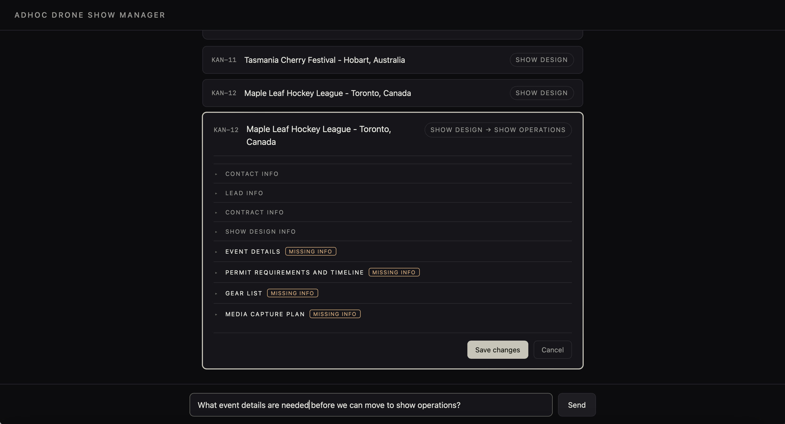
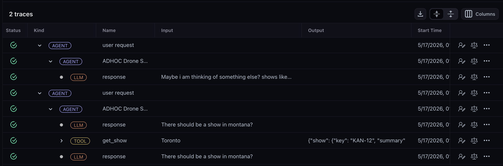

# Drone Show Manager (Jira Bot)

A chat agent that helps ADHOC manage drone shows in Jira. Ships with two front ends — a terminal REPL (`python main.py`) and a dark-themed web chat (`uvicorn backend.web:app`) — that share one agent and one Arize trace lifecycle.

The agent uses OpenAI models, the Jira REST API, and the OpenAI Agents SDK. Every step is traced to Arize AX so you can observe and evaluate it.



## Architecture

```
        ┌──────────────────────┐      ┌────────────────────────────────┐
        │  User (terminal)     │      │  User (browser)                │
        │  $ python main.py    │      │  http://localhost:8000         │
        └──────────┬───────────┘      └───────────────┬────────────────┘
                   │ stdin/stdout                      │ POST /api/session
                   │                                   │ POST /api/chat
                   ▼                                   ▼
        ┌──────────────────────┐      ┌────────────────────────────────┐
        │ agent/drone_show_     │      │ backend/web.py (FastAPI)       │
        │ agent.run()           │      │ • serves frontend/ (HTML/JS)   │
        │ • prints to stderr    │      │ • cards side-channel           │
        └──────────┬───────────┘      └───────────────┬────────────────┘
                   │                                   │  prefix "frontend:"
                   └─────────────────┬─────────────────┘
                                     ▼
                ┌──────────────────────────────────────┐
                │   agent/session.py  AgentSession      │
                │   • one Arize trace per workflow      │
                │   • workflow-boundary detection       │
                │   • history compaction at close       │
                └──────────────┬───────────────────────┘
                               │
                               ▼
      ┌─────────────────────────────────────────────────────────┐
      │       OpenAI Agents SDK Agent  —  gpt-4.1-mini          │
      │  System prompt: pipeline rules · mandatory lookup ·     │
      │                 refusal structure · field→section map   │
      └──┬──────────┬────────────────┬──────────────┬─────────┬─┘
         │          │                │              │         │
         ▼          ▼                ▼              ▼         ▼
      ┌─────┐  ┌──────┐  ┌────────────────────┐  ┌──────┐  ┌────────────┐
      │list_│  │ get_ │  │ list_shows_by_     │  │create│  │ transition │
      │shows│  │ show │  │ field              │  │ show*│  │ show*      │
      └──┬──┘  └──┬───┘  └─────────┬──────────┘  └──┬───┘  └──────┬─────┘
         └────────┴────────────────┴────────────────┴─────────────┘
                                   │
                                   ▼
              ┌──────────────────────────────────────────────┐
              │  backend/                                    │
              │   jira_client.py  — REST wrapper             │
              │   show_format.py  — parser + writer          │
              │   show_schema.py  — rubric (source of truth) │
              └──────────────────┬───────────────────────────┘
                                 │  HTTPS
                                 ▼
                       ┌────────────────────┐
                       │   Jira Cloud       │
                       │   project KAN      │
                       └────────────────────┘

   Observability — branches off every Agent / LLM / Tool span:
     OpenInference instrumentation  →  Arize AX
        ├─ Online LLM judges score live traces (evals/online_evals.md)
        ├─ Offline experiments via evals/run_experiment.py (dataset → run → score)
        └─ Prompt Playground tests prompt variants against the dataset

   * mutates Jira state — guarded by adjacency + required-field checks
```

Both front ends — the terminal REPL and the FastAPI web app — converge on `agent/session.py:AgentSession`, which owns the Arize trace lifecycle (one trace per user workflow, not per turn). The web app adds a `frontend:` prefix to workflow names so its traces are filterable in Arize, and ships show cards as a side-channel alongside the agent's text without altering the text itself.

The agent is one reasoning loop that picks one of five tools per turn. Two of them (`create_show`, `transition_show`) mutate Jira state and are guarded by the schema in `backend/show_schema.py` — the LLM never decides whether a transition is valid; the schema does. Everything else flows through the same backend layer that knows how to parse and write Jira description blocks (three formats supported: plain `Field: value`, split-line, and Jira wiki markup).

## Setup

```bash
git clone <repo>
cd drone-show-manager
python -m venv .venv && source .venv/bin/activate
pip install -r requirements.txt
cp .env.example .env
# fill in OPENAI_API_KEY, JIRA_* and (optional) ARIZE_* keys
python main.py
```

The agent runs locally without Arize keys — tracing just no-ops if `ARIZE_SPACE_ID` or `ARIZE_API_KEY` is missing.

## Web UI

```bash
uvicorn backend.web:app --reload
# open http://localhost:8000
```

A single-page chat interface with the title "ADHOC Drone Show Manager", an opening greeting, and four clickable example prompts. Shows render as cards inline — a small card per row for list results, and a rich card for `get_show` that highlights any fields blocking the next status transition. The dark theme nods to [adhoccreativehouse.com](https://www.adhoccreativehouse.com/).

Under the hood the web server (`backend/web.py`) wraps the same `AgentSession` the terminal REPL uses, so one Arize trace covers each user workflow (which may span multiple chat turns) rather than each HTTP request — see `ARCHITECTURE.md` for why that matters for the live evaluators.

### Deploy to Replit

1. Import this repo into a new Repl.
2. Set `OPENAI_API_KEY`, `JIRA_URL`, `JIRA_USERNAME`, `JIRA_API_TOKEN`, and (optional) `ARIZE_SPACE_ID` / `ARIZE_API_KEY` in Replit Secrets.
3. Hit Run. The `.replit` file already points at `uvicorn backend.web:app`.

## What it can do

Five tools, scoped to Jira project `KAN`:

1. `list_shows(status=None)` — list active shows, or shows in a specific status
2. `get_show(query)` — details for one show by key or name, plus what's missing to advance
3. `list_shows_by_field(section, field, value=None, status=None)` — find shows by a field inside the description, or pull a field across shows
4. `create_show(fields)` — make a new show with Contact + Lead Info
5. `transition_show(key, target_status, new_fields)` — advance one step through the pipeline (Sales → Contract → Show Design → Show Operations → Complete) with required-field validation

## Sample prompts

- *"What active shows do we have?"*
- *"What's in Contract?"*
- *"Tell me about the Toronto show"*
- *"What's missing on Auckland to move forward?"*
- *"Create a show for SkyTech Berlin in Berlin, Germany"*
- *"Move Reykjavik to Show Design"*

## Project layout

```
agent/      system prompt, Agents SDK Agent, shared session/trace lifecycle
tools/      the 5 tools, decorated for the SDK
backend/    Jira client, show schema, parser/writer, Arize tracing, FastAPI web app
frontend/   single-page chat UI (index.html + app.js + style.css)
tests/      parser/writer round-trip tests
```

## Tests

```bash
pytest                          # unit tests (parser/schema, ~11 cases)
python tests/smoke_test.py      # 13-prompt end-to-end test against live Jira
```

`pytest` covers the show description parser — the load-bearing piece (every refusal and "what's missing" depends on it). It auto-skips `tests/smoke_test.py` because pytest only collects files named `test_*.py`.

`tests/smoke_test.py` runs all 13 PRD verification prompts against the real Jira board and reports pass/fail. It snapshots the board before each run and **restores it afterward** — any tickets created during tests are deleted, any status/description changes are reverted. Safe to run repeatedly.

Each smoke test prompt is wrapped in its own named trace (`smoke:01_list_contract`, etc.) so they're easy to filter in the Arize AX dashboard.

## Observability

When `ARIZE_SPACE_ID` and `ARIZE_API_KEY` are set, every turn, tool call, and OpenAI call shows up as a span in Arize AX under the project named in `ARIZE_PROJECT_NAME` (default `drone-show-manager`).



*Each user workflow is one trace; expanding it shows the nested Agent → LLM → Tool spans with the input that opened the workflow and the final output, which the live evaluators score.*

Traces are grouped at the **workflow** level — a single lookup is one trace, while a multi-turn create or transition flow is also one trace that spans all the intake turns. The boundary is detected automatically: a workflow trace closes when a mutation tool fires successfully, or when the agent's response no longer demands more user input. See `ARCHITECTURE.md` for the heuristic.

The exporter uses HTTP/protobuf to `https://otlp.arize.com/v1/traces`. We bypass `arize-otel`'s `register()` because of a bug where `Endpoint.ARIZE` isn't unwrapped from its enum representation when HTTP transport is requested.

LLM-as-judge evals are planned for v2, after the agent stabilizes.
